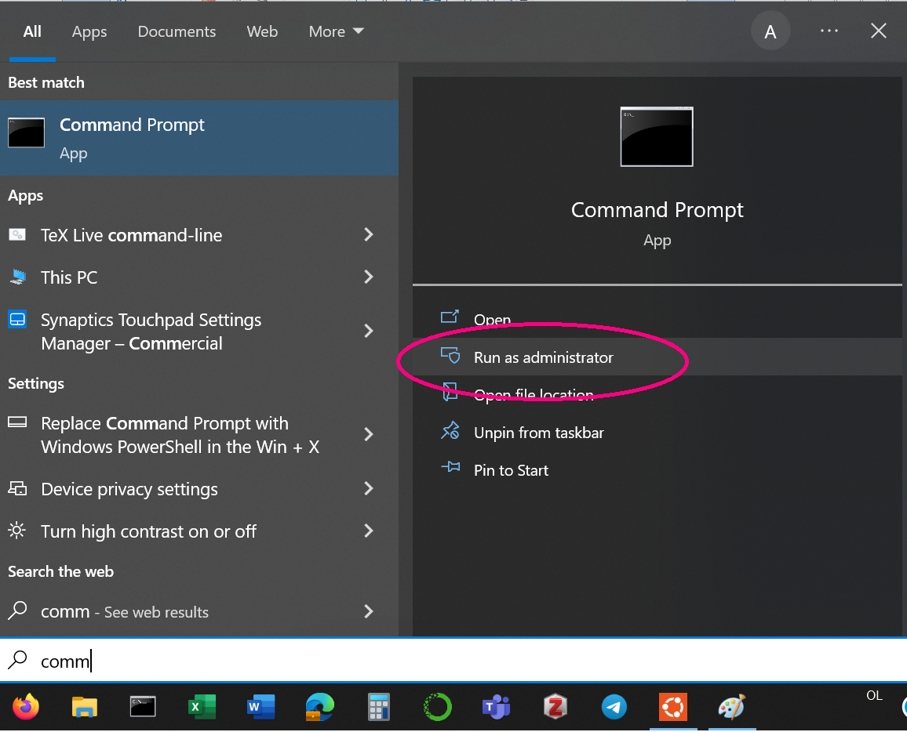
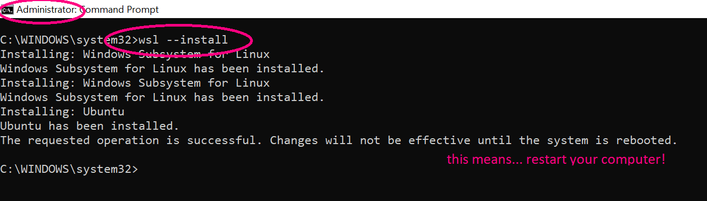
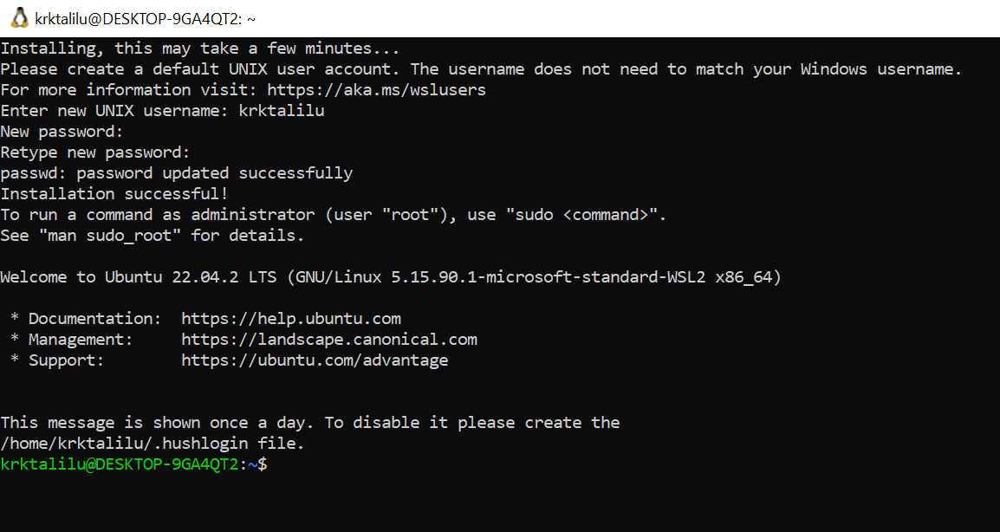
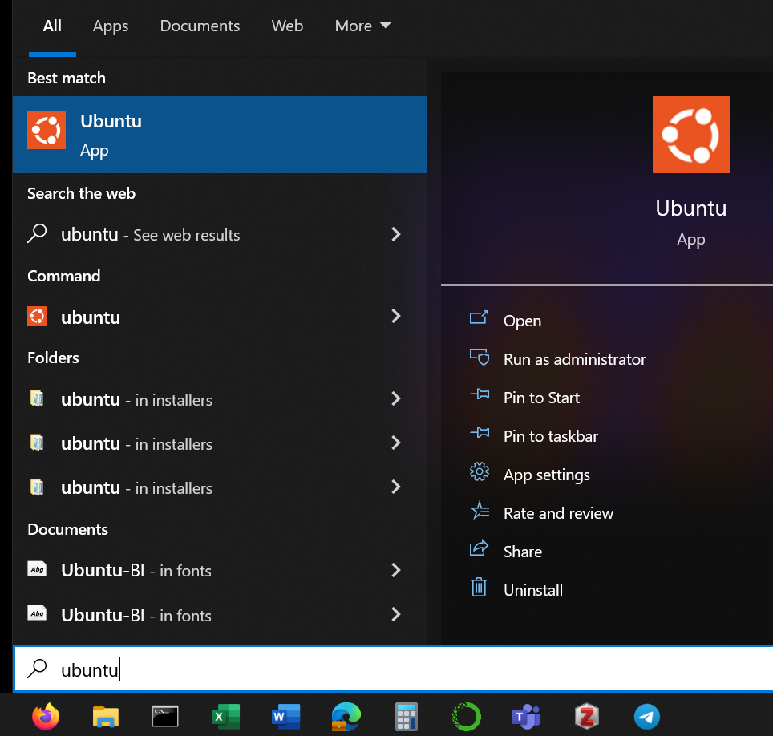
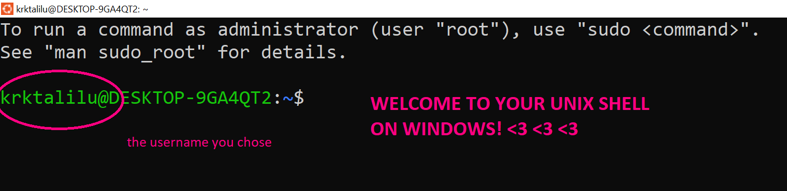

# WSL: Windows Subsystem for Linux. Motivation & installation

## Intro: WSL, why?

If you have a Windows machine and you have installed the Anaconda Distribution, then you already have several **command line interfaces** (CLIs) on your machine:
1. Windows PowerShell (comes with Windows)
2. Command Prompt (comes with Windows)
3. Anaconda Prompt (comes with the Anaconda distribution)

In pt II of the course, you will also learn how to use the **Unix shell** - another very commonly used CLI (and the one installed on macOS/linux by default, called "Terminal"). 

Therefore, as Windows user, you need to install WSL - Windows Subsystem for Linux (read more about WSL [here](https://learn.microsoft.com/en-us/windows/wsl/about)). In short, installing WSL on your Windows machine will add a 4th CLI, the Unix shell, to your machine; this will allow you to **use a Unix shell** on your Windows machine. 

## Instructions: WSL, how?

Find the detailed official instructions [here](https://learn.microsoft.com/en-us/windows/wsl/install). TLDR: If all goes well, all you need to do is: 
1. Open a Windows CLI - either **Windows PowerShell** or **Command Prompt** (NOT Anaconda Prompt) - as **administrator** (search for "Command" or "PowerShell" in Applications, then "open as administrator")
2. Run the following command from the CLI (by typing, then pressing Enter), which will **by default** install the Ubuntu distribution of Linux (which is the one we want):
```
wsl --install
```

3. Restart your computer; at restart, the Ubuntu application will open automatically
4. Set your username and password

**Step 1: Open CLI as Administrator**

<p style="text-align:left;">

</p>

**Step 2: `wsl --install`**

<p style="text-align:left;">

</p>

**Step 3 & 4: After restart, set username & password**

<p style="text-align:left;">

</p>

> **Note** If running `wsl --install` doesn't look like in the screenshot of Step 2 above, but instead shows you a help text (as in the screenshot below), it means that you already have some distribution of WSL installed. [Click here](./WSL_alreadyinstalled.md) for instructions what to do next.

## Accessing the Unix shell

Now, you should be able to open the application `Ubuntu` from your Windows machine. Click on the Windows symbol and type "Ubuntu" to search for the application, then open it.

<p style="text-align:left;">

</p>

**Welcome to your Unix shell on Windows!**

<p style="text-align:left;">

</p>

## Outro: WSL, what's next?

After successfully installing WSL, you will have four shells on your machine:
1. Windows PowerShell (came with Windows)
2. Command Prompt (came with Windows)
3. Anaconda Prompt (came with the Anaconda distribution)
4. Unix shell (came with WSL)

We will mostly use the **Anaconda Prompt** for all things Python and conda (in part I of the course). For the lecture & exercise on shell scripting (in part II of the course), you will need to use the **Unix shell**.