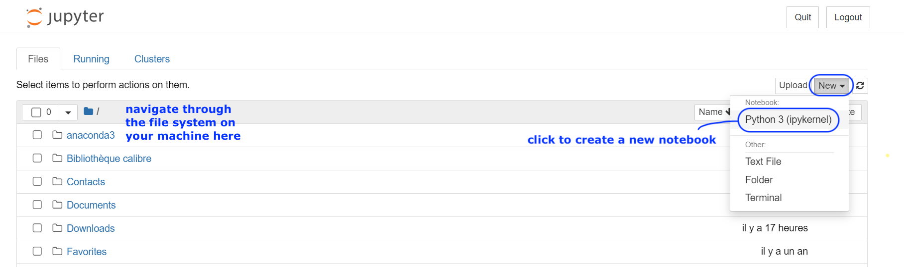

# Checklist for Exercise 01 (bootIT)

Exercise 01 is all about setting up a cozy coding environment on your machine. Brief checklist:

-1. Install the sublime text editor (optional)
0. Install VS Codium (optional)
1. Install an Anaconda distribution
2. Launch & use Jupyter notebook
3. **(only for Windows users)** Install a WSL (Windows Subsystem for Linux) 

Each step is explained in detail below.

## Step -1: Install the sublime text editor (optional, but its probably the best text editor, and can really help with your work)

Install the [sublime text editor](https://www.sublimetext.com).

## Step 0: Install VS Codium (optional)

Install [VS Codium](https://vscodium.com). 
VS Codium is a community-driven, and free (freely licensed) alternative to Microsoft’s VS Code that is built from VS Code’s source but with telemetry/tracking disabled.
If you prefer Microsoft products you can alternatively install [VS Code](https://code.visualstudio.com).
For this course we don't recommend either VS Codium or VS Code, but both are popular development environments.

## Step 1: Install Anaconda

Install an [Anaconda distribution](https://www.anaconda.com/docs/getting-started/installation), follow the installation instructions for your OS (operating system). 

There is the option to choose miniconda, which is a basic version of Anaconda containing only the most bare-boned backages. 
Its much smaller, but unless you are an expert in installing packages and working with package managers(!), we recommend installing the larger Anaconda package which comes with everything you need.

## Step 2: Launch & use Jupyter notebook

### Step 3a: Open up the jupyter notebook application - three ways!
We will work with jupyter notebooks (`.ipynb`) in this class. The jupyter notebook application is part of the Anaconda distrubution you installed in the previous step. There are multiple ways of opening up the jupyter notebook application. Make sure you try out the different steps:
1. Through Anaconda Navigator, in your browser: go to the Anaconda Navigator, search for jupyter notebook, and click `Launch`
2. (only possible if you installed VS Codium) Through Anaconda Navigator, in VS Codium: go to the Anaconda Navigator, search for VS Codium, and `Launch` (more details [here](https://www.anaconda.com/docs/tools/anaconda-navigator/main); alternatively, you can also launch VS Codium directly and use the file browsing system to open up or create a jupyter notebook)
3. Through the command line interface (CLI): open your CLI (see below), type `jupyter notebook` and press Enter. The notebook should then open in a browser window. I, __Vedran__, prefer this option. 

#### Note: How do I open up the CLI? 
* macOS & linux users: search for "Terminal" in your Applications
* Windows users: !! search for "Anaconda Prompt" in your Applications. (Do NOT use the preinstalled "Windows Terminal" application)

**Screenshot of the Jupyter Notebook app in a web browser**

    

### Step 3b: Open and run a downloaded jupyter notebook
1. Download the jupyter notebook [`exercise01_testIT.ipynb`](./exercise01_testIT.ipynb) to your machine, to the folder of your choice
2. Open up the jupyter notebook application with the method of your choice (step 3a)
3. Navigate to the folder where the jupyter notebook is stored, and open the notebook file (if you are using a CLI, you can navigate to the directory first and then open up a `juputery notebook` there)
4. Run all cells in the notebook by clicking on `Cell > Run All`
5. If all worked well, you should receive a friendly greeting in the notebook.

#### Note: Make the notebook "trusted"
If in your browser, make sure that the notebook is "trusted" (the top right button should say "Trusted"; if it says "Not Trusted", click and confirm to make the notebook trusted) - see screenshot below.

**Screenshot of the testIT jupyter notebook**

    

## Step 4 (only for windows users): Install WSL

If you are a macOS/Linux user: you're done for today! **If you are a Windows user**, your last task is to [install a WSL (Windows Subsystem for Linux) on your machine](./WSL.md). 
